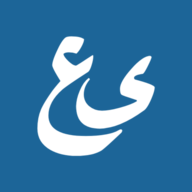

  

  

  
  
  
  
    
  
  

   

   
  
  

  
  
  

## Features & Roadmap
- [x] Showing random quotes daily
- [x] Showing prayer times for the day by selected city
- [x] Prayer times for current hijri month
- [x] Progressive Web App ready
- [x] Amoled/Dark modes
- [ ] Occasional themes by events type (national, religion, global)
- [ ] Tracking seen daily hikams

## Screenshots

|                                                         Splash screen (PWA)                                                          |                                                           In action                                                            |                                                       Separated activity (PWA)                                                       |
|:------------------------------------------------------------------------------------------------------------------------------:|:------------------------------------------------------------------------------------------------------------------------------:|:------------------------------------------------------------------------------------------------------------------------------:|
|  |  |  |
|                                                          Tablet mode                                                           |                                                       Amoled/Dark modes                                                        |                                                        Theming options                                                         |
|  |  |  |
## Download
- A browser extension version is also made for a quicker access for these browsers:

| Mozilla Firefox | Microsoft Edge | Google Chrome |              Web               |
|:---------------:|:--------------:|:-------------:|:------------------------------:|
| [Mozilla Add-ons](https://addons.mozilla.org/firefox/addon/bouayadapp-%D8%A7%D9%84%D9%8A%D9%88%D9%85%D9%8A%D8%A9-%D8%A7%D9%84%D8%B9%D8%B5%D8%B1%D9%8A%D8%A9/) | [Edge Add-ons](https://microsoftedge.microsoft.com/addons/detail/bouayadapp-%D8%A7%D9%84%D9%8A%D9%88%D9%85%D9%8A%D8%A9-%D8%A7%D9%84%D8%B9%D8%B5/hjkanamopcgpejnjckfkocleokagaeak) | [Chrome web store](https://chrome.google.com/webstore/detail/bouayadapp-اليومية-العصري/homjiaebdnpmepkeiiipamadbbpkgcij) | [PWA](https://web.bouayad.app) |

## Releases
- Please see the [changelog](https://github.com/moghwan/web.bouayad.app/releases) for more details about all releases notes, [RSS feed](https://github.com/moghwan/web.bouayad.app/releases.atom) is also available.

## Transparency warning
Production & development deployments on Cloudflare Pages may use third-party tools to measure site performance, and the app uses Google Analytics.
The app itself does not collect any data (eg. when you're running it on your own machine).

## Contributing
- This repo is open to your contributions! Any improvements or a feature request are greatly appreciated
- The project is still under development, please refer to [project progress](https://github.com/users/moghwan/projects/2) and [CONTRIBUTING.md](./CONTRIBUTING.md)
- A repo for major browsers' extension is also made and available at [ext.bouayad.app](https://github.com/moghwan/ext.bouayad.app)

## Support
- This project development is maintained in my free time, giving us a Star is greatly appreciated!
- If you like this project, please consider [buying a coffee](https://www.buymeacoffee.com/moghwan). You won't be annoyed to do so while using the app or the browser extension!

## Stay in touch
* Website - [bouayad.app](https://bouayad.app)
* Twitter - [@BouayadApp](https://twitter.com/bouayadapp)
* Twitter (Author) - [@moghwan](https://twitter.com/moghwan)

## License
See the [LICENSE](./LICENSE) file for licensing information
